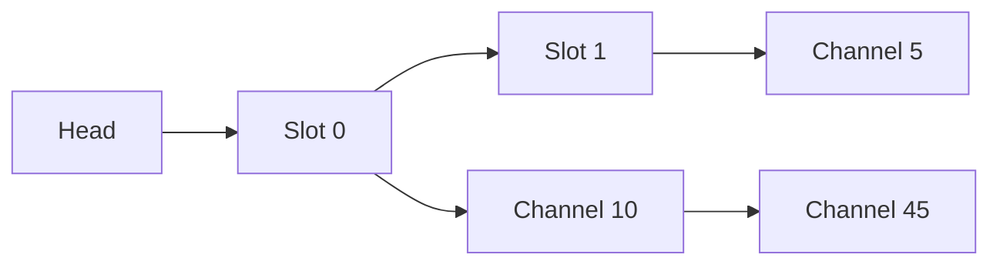

# Linux Kernel Message Slot Driver

**A custom Linux kernel module implementing a multi-channel Inter-Process Communication (IPC) mechanism via character devices.**

## Overview

This project implements a character device driver (`message_slot`) that allows distinct processes to exchange messages through a unified interface file. Unlike standard pipes or queues, this driver implements a **channel-based architecture**, where a single device file can host multiple independent data streams (channels).

The project demonstrates low-level kernel programming concepts including:
* Character device registration and management.
* User-space to Kernel-space memory transfer (`copy_from_user` / `copy_to_user`).
* Custom `ioctl` command implementation.
* Dynamic memory management within the kernel (using `kmalloc`/`kfree`).
* Complex data structures (Nested Linked Lists) for efficient resource scaling.

## Key Features

* **Multi-Channel Support:** A single device file supports up to $2^{32}$ independent channels.
* **Dynamic Allocation:** Channels are allocated lazily upon first use, optimizing memory usage.
* **Censorship Mode:** An optional feature toggled via `ioctl` that processes messages in kernel space, censoring specific byte patterns before storage.
* **Atomic Operations:** Ensures data integrity during read/write operations.
* **Standard Interface:** Complies with standard Linux file operations (`open`, `read`, `write`, `ioctl`, `release`).

## Architecture

The driver uses a **Nested Linked List** data structure to manage memory efficiently:

1.  **Slots List:** A global linked list where each node represents an active device file (distinguished by Minor Number).
2.  **Channels List:** Each Slot node contains a pointer to a linked list of Channels.



This ensures that memory is only consumed for channels that are actively in use, rather than pre-allocating a massive static array.

## Installation & Build

### Prerequisites
* Linux Kernel Headers (5.x+)
* GCC Compiler
* Make

### Compilation
Build the kernel module and the user-space CLI tools:

```bash
make
gcc -O3 -Wall -std=c11 message_sender.c -o message_sender
gcc -O3 -Wall -std=c11 message_reader.c -o message_reader
```

### Loading the Module
Insert the compiled module into the kernel:

```bash
sudo insmod message_slot.ko
```

## Usage

### 1. Create a Device Node
Manually create the character device file (Major Number 235):

```bash
sudo mknod /dev/slot0 c 235 0
sudo chmod 777 /dev/slot0
```

### 2. Sending Messages
Use the `message_sender` utility to write to a specific channel.

**Syntax:**
```bash
./message_sender <device_path> <channel_id> <censorship_flag> <message>
```
* `channel_id`: Integer (non-negative).
* `censorship_flag`: `0` for raw storage, `1` for censorship (replaces every 4th char with `#`).

**Example:**
```bash
./message_sender /dev/slot0 10 0 "Hello Kernel!"
```

### 3. Reading Messages
Use the `message_reader` utility to read from a specific channel.

**Syntax:**
```bash
./message_reader <device_path> <channel_id>
```

**Example:**
```bash
./message_reader /dev/slot0 10
# Output: Hello Kernel!
```

## Technical Implementation Details

* **Memory Safety:** The module strictly validates all user pointers and buffer lengths to prevent kernel panics or unauthorized memory access.
* **Cleanup:** The `__exit` routine traverses the entire nested linked list structure to free every allocated `slot_t` and `channel_t` node, ensuring zero memory leaks upon module unloading.
* **Context Management:** Uses `file->private_data` to maintain state (Current Channel ID & Censorship Mode) across different system calls for a single file descriptor.

## License
GPL
